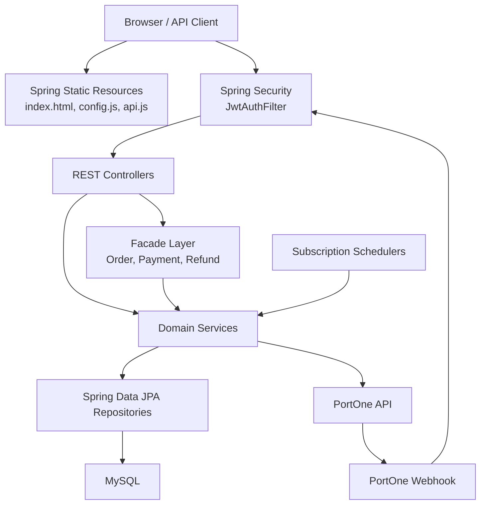
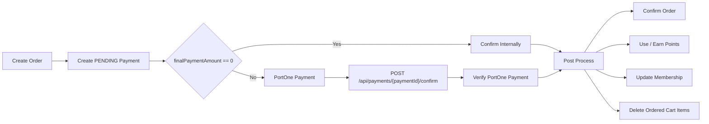
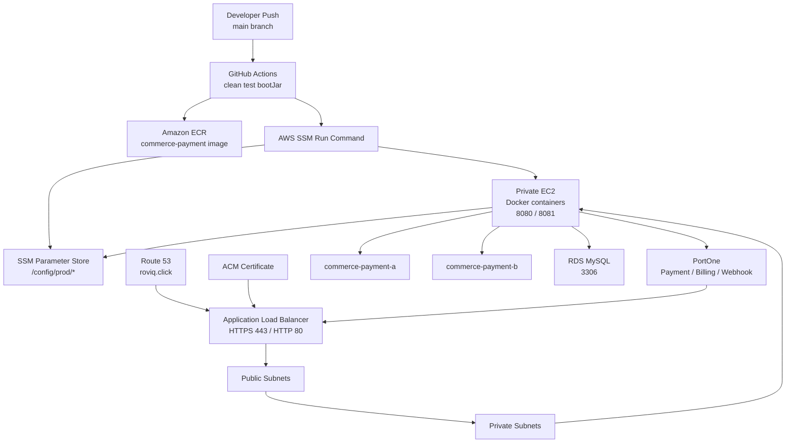

# Commerce Payment System

커머스 주문, 결제, 환불, 포인트, 멤버십, 구독 결제를 하나의 흐름으로 다루는 Spring Boot 기반 결제 시스템입니다.

이 프로젝트는 일반 상품 주문뿐 아니라 PortOne 결제 승인, 포인트 전액 결제, 포인트와 PG 결제를 함께 사용하는 복합 결제, 부분 환불, 전체 환불, 멤버십 등급 산정, 정기 구독 결제, PortOne Webhook 후처리를 포함합니다.

> [!NOTE]
> **배포 환경 및 접속 안내**
> 과제 채점 기간 동안 아래 링크를 통해 실제 배포된 애플리케이션의 동작(결제 및 구독 등)을 직접 테스트해 보실 수 있습니다.
> - **배포 주소:** [https://roviq.click](https://roviq.click)
> - 과제 채점 기간 동안 상시 배포 활성화 상태가 유지됩니다.

README는 프로젝트의 첫 화면 역할만 담당합니다. API 명세, ERD, 상세 시퀀스, 운영 절차는 [Wiki](#문서-링크wiki)에서 확인합니다.

## 프로젝트 소개

Commerce Payment System은 쇼핑몰에서 결제 도메인을 안정적으로 처리하기 위한 백엔드 애플리케이션입니다.

핵심 설계 방향은 다음과 같습니다.

- 주문 생성과 결제 확정을 분리합니다.
- 결제 전에는 `PENDING` 결제를 생성하고, 결제 승인 이후에 주문 확정과 후처리를 수행합니다.
- 포인트 전액 결제는 외부 PG 조회 없이 내부 결제 확정으로 처리합니다.
- PG 결제가 필요한 경우 PortOne 결제 조회 결과를 내부 결제 데이터와 검증합니다.
- 환불은 PG 취소와 내부 후처리를 분리해 실패 지점을 추적합니다.
- 포인트 적립, 포인트 사용, 사용 포인트 복구, 적립 포인트 회수를 모두 이력으로 남깁니다.
- 멤버십 등급은 누적 결제 금액을 기준으로 관리합니다.
- 구독 결제는 빌링키 기반 PortOne 정기 결제와 미납 재시도를 지원합니다.
- PortOne Webhook은 수신 기록, 중복 방지, 결제/환불 후처리를 담당합니다.

## 주요 기능

### 회원 및 인증

- 회원가입
- 로그인
- JWT Access Token 발급
- JWT 기반 API 인증
- 회원 탈퇴
- Spring Security 기반 인증/인가 처리

### 상품

- 상품 등록
- 상품 목록 조회
- 상품 상세 조회
- 상품 수정
- 상품 소프트 삭제
- 상품 상태 관리
- 상품 카테고리 관리

### 장바구니

- 장바구니 상품 추가
- 내 장바구니 조회
- 장바구니 상품 수량 변경
- 장바구니 상품 삭제
- 장바구니 비우기

### 주문

- 장바구니 기반 주문 미리보기
- 주문 생성
- 주문 목록 조회
- 주문 상세 조회
- 결제 전 주문 취소
- 주문 생성 시 재고 차감
- 결제 확정 후 주문 상태 확정

### 결제

- 주문 생성 시 `PENDING` 결제 생성
- PortOne 결제 승인 검증
- 일반 PG 결제
- 포인트 전액 결제
- 포인트와 PG를 함께 사용하는 복합 결제
- 결제 확정 후 주문, 포인트, 멤버십, 장바구니 후처리
- 결제 Webhook 기반 확정 처리

### 환불

- 주문 상품 단위 부분 환불
- 전체 환불
- PG 환불 금액과 포인트 환불 금액 분리 계산
- 환불 수량 검증
- 환불 가능 금액 초과 방지
- 환불 후 재고 복구
- 환불 후 포인트 복구 및 적립 포인트 회수
- 환불 후 멤버십 누적 결제 금액 차감

### 포인트

- 포인트 잔액 조회
- 포인트 이력 조회
- 결제 완료 시 포인트 적립
- 결제 시 포인트 사용
- 환불 시 사용 포인트 복구
- 환불 시 적립 포인트 회수
- 주문 포인트와 구독 포인트 출처 분리

### 멤버십

- 회원가입 시 기본 등급 생성
- 내 멤버십 조회
- 멤버십 등급 목록 조회
- 누적 결제 금액 기반 등급 산정
- 결제/환불 후 멤버십 누적 금액 반영
- 결제/환불 이력 기반 멤버십 재계산

### 구독

- PortOne 빌링키 결제 수단 등록
- 구독 시작
- 구독 해지
- 내 활성 구독 조회
- 최초 구독 결제
- 매일 정기 결제 스케줄러
- 미납 구독 재시도 스케줄러
- 구독 결제 성공 시 포인트 적립 및 멤버십 반영

### Webhook

- PortOne Webhook 수신
- Webhook 서명 검증
- Webhook Payload 파싱
- Webhook 수신 이력 저장
- 중복 Webhook 처리 방지
- 결제 완료 Webhook 후처리
- 환불 완료 Webhook 후처리
- 실패한 Webhook 상태 기록

## 기술 스택

### Backend

- Java 21
- Spring Boot 4.0.6
- Spring Web MVC
- Spring Security
- Spring Validation
- Spring Data JPA
- Hibernate
- Flyway
- Lombok

### Authentication

- JWT
- JJWT 0.12.6
- BCrypt Password Encoder
- Stateless Security Filter Chain

### Database

- MySQL
- H2
- Flyway MySQL
- JPA `ddl-auto: validate`

### Payment

- PortOne Server SDK
- PortOne REST API
- PortOne Browser SDK
- PortOne Webhook
- Billing Key Payment

### Build and Test

- Gradle
- JUnit 5
- Spring Boot Test
- Spring Security Test

### Frontend Test Page

- Static HTML
- CSS
- Vanilla JavaScript
- PortOne Browser SDK

### Deployment

- Docker
- GitHub Actions
- Amazon ECR
- AWS EC2
- AWS RDS for MySQL
- AWS Systems Manager Parameter Store
- AWS Systems Manager Run Command
- AWS Application Load Balancer
- AWS Route 53
- AWS ACM

## 시스템 아키텍처

### Application Architecture



### Payment Flow Summary



### AWS Deployment Architecture



## 프로젝트 구조

```text
commerce-payment-system
├── .github
│   └── workflows
│       └── deploy.yml
├── docs
│   ├── deployment
│   └── wiki
├── gradle
├── src
│   ├── main
│   │   ├── java
│   │   │   └── com
│   │   │       └── commercepaymentsystem
│   │   │           ├── domain
│   │   │           │   ├── auth
│   │   │           │   ├── cart
│   │   │           │   ├── member
│   │   │           │   ├── membership
│   │   │           │   ├── order
│   │   │           │   ├── payment
│   │   │           │   ├── point
│   │   │           │   ├── product
│   │   │           │   ├── refund
│   │   │           │   ├── subscription
│   │   │           │   └── webhook
│   │   │           ├── global
│   │   │           │   ├── config
│   │   │           │   ├── controller
│   │   │           │   ├── entity
│   │   │           │   ├── exception
│   │   │           │   ├── filter
│   │   │           │   ├── jwt
│   │   │           │   └── response
│   │   │           └── infrastructure
│   │   │               └── portone
│   │   └── resources
│   │       ├── db
│   │       │   └── migration
│   │       ├── static
│   │       ├── application.yaml
│   │       ├── application-local.yaml
│   │       └── application-prod.yaml
│   └── test
├── Dockerfile
├── build.gradle
└── settings.gradle
```

### Domain Packages

| Package | Role |
| --- | --- |
| `domain.auth` | 회원가입, 로그인, JWT 발급 |
| `domain.member` | 회원 정보, 회원 탈퇴, 포인트 잔액 |
| `domain.product` | 상품 등록, 조회, 수정, 삭제, 재고 |
| `domain.cart` | 장바구니 상품 관리 |
| `domain.order` | 주문 생성, 조회, 취소 |
| `domain.payment` | 결제 생성, 승인 검증, 결제 후처리 |
| `domain.refund` | 환불 준비, PG 취소, 환불 후처리 |
| `domain.point` | 포인트 적립, 사용, 복구, 회수, 이력 |
| `domain.membership` | 멤버십 등급, 누적 금액, 등급 재계산 |
| `domain.subscription` | 구독, 빌링키 결제, 스케줄러, 미납 재시도 |
| `domain.webhook` | Webhook 수신 이력과 비즈니스 후처리 |
| `infrastructure.portone` | PortOne API, DTO, Webhook 서명 검증 |
| `global` | 보안, JWT, 공통 응답, 예외 처리, JPA 설정 |

## 배포 환경

### Runtime

- Java 21
- Spring profile: `prod`
- Application port: `8080`
- Docker image base: `eclipse-temurin:21-jre-alpine`
- Timezone: `Asia/Seoul`

### Database

- AWS RDS MySQL
- JDBC URL은 `DB_URL` 환경 변수로 주입합니다.
- 운영에서는 `spring.jpa.hibernate.ddl-auto=validate`를 사용합니다.
- 스키마 변경은 Flyway migration으로 관리합니다.

### Deployment Pipeline

1. `main` 브랜치에 push합니다.
2. GitHub Actions가 JDK 21 환경에서 `./gradlew clean test bootJar`를 실행합니다.
3. Docker Buildx로 `linux/arm64` 이미지를 빌드합니다.
4. 이미지를 Amazon ECR `commerce-payment` repository에 push합니다.
5. GitHub Actions가 AWS SSM Run Command로 Private EC2에 배포 명령을 전달합니다.
6. EC2는 ECR에서 이미지를 pull합니다.
7. SSM Parameter Store의 `/config/prod/*` 값을 `.env`로 생성합니다.
8. `commerce-payment-a`, `commerce-payment-b` 컨테이너를 8080/8081 포트로 교체 배포합니다.
9. 새 컨테이너 health check가 성공하면 ALB Target Group에 등록합니다.
10. 기존 컨테이너를 Target Group에서 제거하고 정리합니다.

### Required Environment Variables

| Name | Description |
| --- | --- |
| `DB_URL` | RDS MySQL JDBC URL |
| `DB_USERNAME` | RDS 사용자명 |
| `DB_PASSWORD` | RDS 비밀번호 |
| `JWT_SECRET` | Base64 인코딩된 JWT 서명 키 |
| `JWT_ACCESS_TOKEN_EXPIRATION` | JWT 만료 시간 |
| `PORTONE_API_SECRET` | PortOne API Secret |
| `PORTONE_STORE_ID` | PortOne Store ID |
| `PORTONE_CHANNEL_KEY` | PortOne 일반 결제 Channel Key |
| `PORTONE_BILLING_CHANNEL_KEY` | PortOne 빌링 결제 Channel Key |
| `PORTONE_CONNECT_TIMEOUT` | PortOne 연결 타임아웃 |
| `PORTONE_READ_TIMEOUT` | PortOne 읽기 타임아웃 |
| `PORTONE_WEBHOOK_SECRET` | PortOne Webhook 서명 검증 Secret |

### Public Origin

- Production frontend/API origin: `https://roviq.click`
- Local API base URL: `http://localhost:8080`
- Static client config: `src/main/resources/static/config.js`
- Static API wrapper: `src/main/resources/static/api.js`

## 문서 링크(Wiki)

- [Wiki Home](docs/wiki/Home.md)
- [Architecture](docs/wiki/Architecture.md)
- [ERD](docs/wiki/ERD.md)
- [API Specification](docs/wiki/API-Specification.md)
- [Authentication](docs/wiki/Authentication.md)
- [Payment](docs/wiki/Payment.md)
- [Refund](docs/wiki/Refund.md)
- [Point](docs/wiki/Point.md)
- [Membership](docs/wiki/Membership.md)
- [Subscription](docs/wiki/Subscription.md)
- [Webhook](docs/wiki/Webhook.md)
- [AWS Infrastructure](docs/wiki/AWS-Infrastructure.md)
- [Deployment Guide](docs/wiki/Deployment-Guide.md)
- [Troubleshooting](docs/wiki/Troubleshooting.md)
