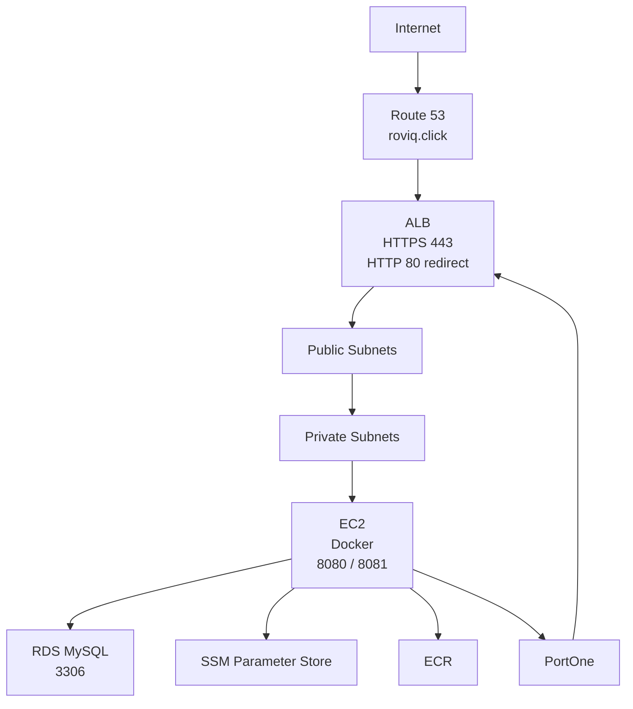

# AWS Infrastructure

이 문서는 현재 프로젝트의 GitHub Actions 배포 workflow와 운영 설정을 기준으로 작성했습니다.

## 구성 요소

| Component | Usage |
| --- | --- |
| EC2 | Spring Boot Docker container 실행 |
| Docker | 애플리케이션 컨테이너 실행 |
| ECR | Docker image 저장소 |
| RDS MySQL | 운영 데이터베이스 |
| SSM Parameter Store | 운영 환경 변수와 secret 저장 |
| SSM Run Command | Private EC2 배포 명령 실행 |
| ALB | HTTPS 진입점과 target group 기반 컨테이너 교체 |
| Route 53 | 도메인 연결 |
| ACM | HTTPS 인증서 |
| Security Group | ALB, EC2, RDS 접근 제어 |

## 네트워크 구조



## EC2

- Private subnet에 배치합니다.
- Public IP를 사용하지 않는 구성을 기준으로 합니다.
- SSM Session Manager와 SSM Run Command로 접근합니다.
- Docker를 설치하고 애플리케이션 컨테이너를 실행합니다.
- GitHub Actions가 SSM Run Command를 통해 배포 명령을 전달합니다.
- 배포 workflow는 `commerce-payment-a`, `commerce-payment-b` 컨테이너를 8080/8081로 번갈아 실행합니다.

TODO: EC2 Instance Screenshot

## RDS

- MySQL을 사용합니다.
- Private subnet DB subnet group에 배치합니다.
- Spring Boot는 `DB_URL`, `DB_USERNAME`, `DB_PASSWORD`로 연결합니다.
- 운영 JPA 설정은 `ddl-auto: validate`입니다.
- schema 변경은 Flyway migration으로 관리합니다.

TODO: RDS Screenshot

## Security Group

권장 접근 제어:

| Source | Target | Port | Purpose |
| --- | --- | ---: | --- |
| Internet | ALB | 80 | HTTP to HTTPS redirect |
| Internet | ALB | 443 | HTTPS service |
| ALB SG | EC2 SG | 8080 | active container |
| ALB SG | EC2 SG | 8081 | next container |
| EC2 SG | RDS SG | 3306 | MySQL connection |

TODO: Security Group Screenshot

## Docker

Dockerfile:

- base image: `eclipse-temurin:21-jre-alpine`
- timezone: `Asia/Seoul`
- copied jar: `build/libs/app.jar`
- exposed port: `8080`
- runtime profile: `prod`

Container command:

```bash
java -jar -Dspring.profiles.active=prod app.jar
```

## SSM Parameter Store

배포 workflow는 `/config/prod/` 경로의 parameter를 읽어 `.env` 파일을 생성합니다.

필수 parameter:

- `DB_URL`
- `DB_USERNAME`
- `DB_PASSWORD`
- `JWT_SECRET`
- `JWT_ACCESS_TOKEN_EXPIRATION`
- `PORTONE_API_SECRET`
- `PORTONE_STORE_ID`
- `PORTONE_CHANNEL_KEY`
- `PORTONE_BILLING_CHANNEL_KEY`
- `PORTONE_CONNECT_TIMEOUT`
- `PORTONE_READ_TIMEOUT`
- `PORTONE_WEBHOOK_SECRET`
- `ALB_TARGET_GROUP_ARN`

## GitHub Actions

배포 workflow:

1. `main` 브랜치 push로 실행됩니다.
2. JDK 21을 설정합니다.
3. `./gradlew clean test bootJar`를 실행합니다.
4. Docker image를 `linux/arm64`로 빌드합니다.
5. ECR에 `latest`, `{github.sha}` tag로 push합니다.
6. SSM Run Command로 EC2에 배포합니다.
7. 새 컨테이너 health check 후 ALB Target Group에 등록합니다.
8. 기존 컨테이너를 Target Group에서 제거하고 중지합니다.

