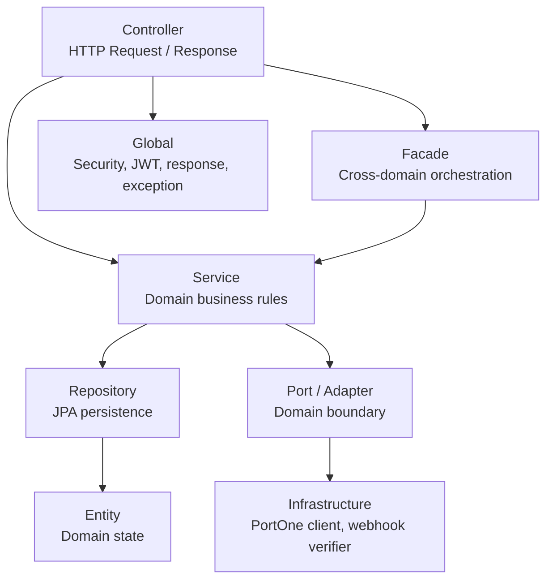
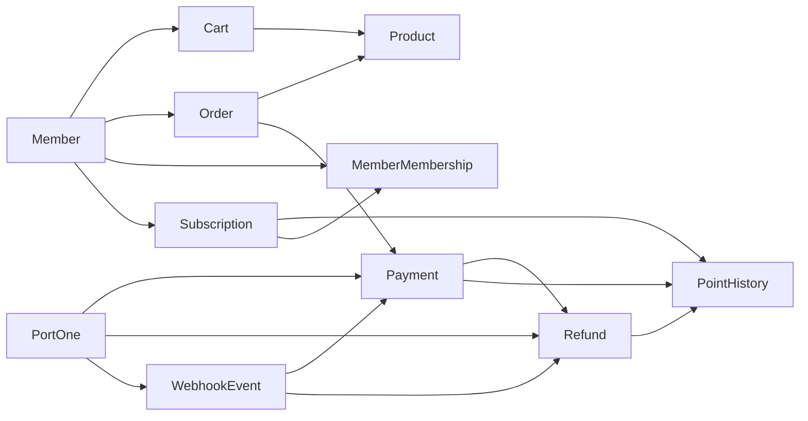

# Architecture

## 프로젝트 구조

```text
src/main/java/com/commercepaymentsystem
├── domain
│   ├── auth
│   ├── cart
│   ├── member
│   ├── membership
│   ├── order
│   ├── payment
│   ├── point
│   ├── product
│   ├── refund
│   ├── subscription
│   └── webhook
├── global
│   ├── config
│   ├── controller
│   ├── entity
│   ├── exception
│   ├── filter
│   ├── jwt
│   └── response
└── infrastructure
    └── portone
```

## 레이어 구조



## 패키지 구조

| Package | Responsibility |
| --- | --- |
| `domain.auth` | 회원가입, 로그인, 로그아웃, JWT 발급 |
| `domain.member` | 회원 기본 정보, 회원 탈퇴, 포인트 잔액 |
| `domain.product` | 상품, 재고, 카테고리, 판매 상태 |
| `domain.cart` | 장바구니와 장바구니 항목 |
| `domain.order` | 주문, 주문 항목, 주문 상태 |
| `domain.payment` | 결제 생성, 결제 확정, PortOne 검증, 결제 후처리 |
| `domain.refund` | 환불 준비, 환불 상태, PG 취소, 환불 후처리 |
| `domain.point` | 포인트 잔액 변경과 포인트 이력 |
| `domain.membership` | 멤버십 등급과 누적 결제 금액 |
| `domain.subscription` | 구독, 결제 수단, 정기 결제, 미납 재시도 |
| `domain.webhook` | Webhook 이벤트 저장, 중복 처리, 후처리 |
| `infrastructure.portone` | PortOne REST Client, DTO, Webhook 서명 검증 |
| `global` | 공통 설정, JWT, 보안 필터, 예외 응답, 공통 응답 |

## 도메인 구조



## 주요 설계 특징

- 결제 확정, 환불, 구독 결제처럼 여러 도메인을 함께 변경하는 흐름은 Facade 또는 orchestration service에서 조율합니다.
- 외부 PG 호출은 DB 트랜잭션과 분리하려는 구조를 사용합니다.
- `PaymentPostProcessService`는 결제 확정 후 주문 확정, 포인트 처리, 멤버십 반영, 장바구니 정리를 수행합니다.
- `RefundPostProcessService`는 환불 후 재고 복구, 포인트 복구/회수, 멤버십 차감, 전체 환불 시 주문 취소를 수행합니다.
- `WebhookService`는 Webhook 수신 기록과 비즈니스 처리를 분리해 중복 수신과 실패 상태를 추적합니다.
- 운영 DB schema는 Flyway가 관리하고, JPA는 `ddl-auto: validate`로 검증합니다.

