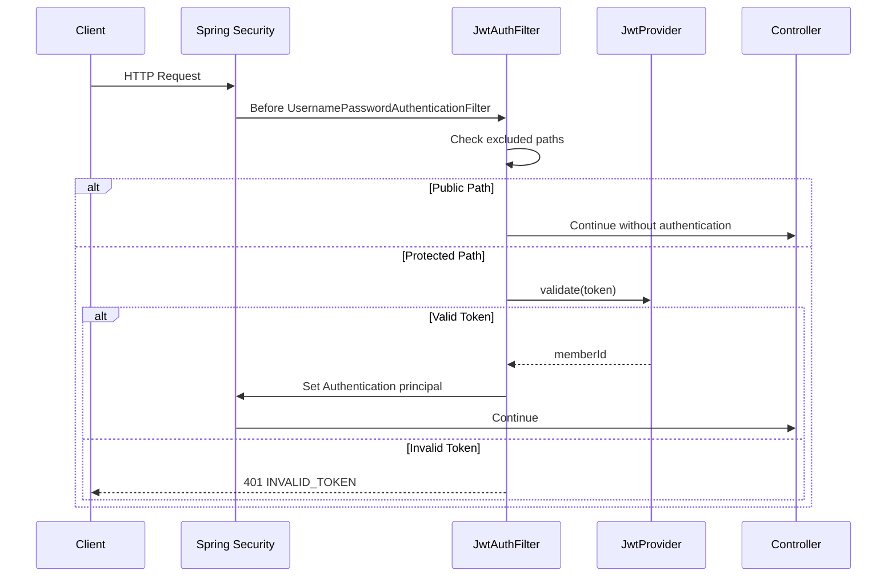

# Authentication

이 프로젝트는 Spring Security와 JWT Access Token 기반 stateless 인증을 사용합니다.

## 로그인 흐름

1. 클라이언트가 `POST /api/auth/login`으로 이메일과 비밀번호를 전송합니다.
2. `AuthService`가 이메일로 회원을 조회합니다.
3. 탈퇴하지 않은 회원인지 확인합니다.
4. `BCryptPasswordEncoder`로 비밀번호를 검증합니다.
5. `JwtProvider`가 회원 ID를 subject로 하는 JWT를 발급합니다.
6. 응답의 `accessToken`과 `tokenType=Bearer`를 클라이언트에 반환합니다.

## JWT 발급

`JwtProvider.createToken(memberId, email)`은 다음 값을 포함합니다.

| Claim | Value |
| --- | --- |
| `sub` | memberId |
| `email` | member email |
| `iat` | 발급 시각 |
| `exp` | `jwt.expiration` 기준 만료 시각 |

서명 키는 `jwt.secret` 설정값을 Base64 decode한 뒤 HMAC key로 사용합니다.

## JWT 검증

인증이 필요한 API는 다음 헤더를 사용합니다.

```http
Authorization: Bearer {accessToken}
```

`JwtAuthFilter`는 다음 순서로 검증합니다.

1. 제외 경로인지 확인합니다.
2. `Authorization` 헤더가 `Bearer `로 시작하는지 확인합니다.
3. JWT signature와 expiration을 검증합니다.
4. JWT subject에서 `memberId`를 추출합니다.
5. `UsernamePasswordAuthenticationToken`의 principal에 `Long memberId`를 저장합니다.
6. Controller는 `@AuthenticationPrincipal Long memberId`로 회원 ID를 받습니다.

## Security Filter Chain



## Public API

Security 설정상 다음 API는 인증 없이 접근할 수 있습니다.

- `POST /api/auth/signup`
- `POST /api/auth/login`
- `POST /api/auth/logout`
- `GET /api/products/**`
- `POST /api/payments/webhooks/portone`

정적 리소스와 기본 페이지도 인증 제외 대상입니다.

## CORS

허용 origin pattern:

- `https://roviq.click`
- `http://localhost:*`
- `http://127.0.0.1:*`

허용 method:

- `GET`
- `POST`
- `PUT`
- `PATCH`
- `DELETE`
- `OPTIONS`

