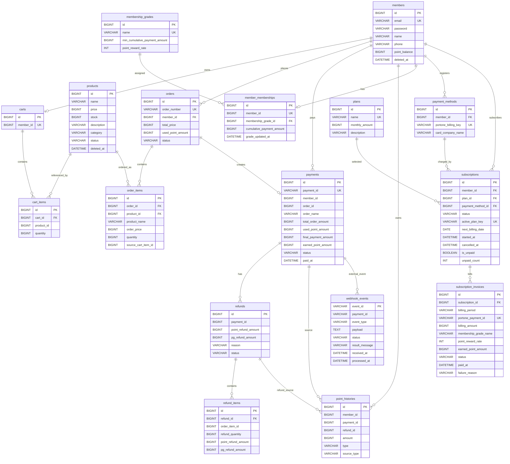

# ERD

이 문서는 현재 JPA Entity와 Flyway migration을 기준으로 작성했습니다.

일부 관계는 JPA 객체 연관관계 또는 DB FK로 선언되어 있고, 일부는 `member_id`, `payment_id`, `order_id` 값 기반 논리 참조로 연결됩니다.

## ERD Diagram

## 관계 설명

### Member

- `members`는 회원의 인증 정보와 포인트 잔액을 저장합니다.
- `orders`, `payments`, `point_histories`, `payment_methods`, `subscriptions`는 `member_id`로 회원을 참조합니다.
- `member_memberships`는 회원별 멤버십 상태를 1:1로 저장합니다.
- `carts`는 회원별 장바구니를 1:1로 저장합니다.

### Product

- `products`는 상품명, 가격, 재고, 상태, 카테고리를 저장합니다.
- `cart_items.product_id`는 장바구니에 담긴 상품 ID입니다.
- `order_items.product_id`는 주문 당시 상품을 참조하고, `product_name`, `order_price`는 주문 시점 스냅샷입니다.

### Cart

- `carts.member_id`는 회원별 장바구니를 구분합니다.
- `cart_items`는 `cart_id`와 `product_id` 조합에 unique constraint를 둡니다.

### Order

- `orders`는 회원의 주문 단위입니다.
- `order_items`는 주문 상품 목록입니다.
- 주문 생성 시 상품 재고를 차감하고 `PENDING` 상태의 결제를 생성합니다.

### Payment

- `payments.payment_id`는 외부 PortOne 결제 ID로도 사용되는 고유 값입니다.
- `total_order_amount`, `used_point_amount`, `final_payment_amount`를 함께 저장합니다.
- `final_payment_amount`가 0이면 포인트 전액 결제입니다.
- 결제 상태는 `PENDING`, `CONFIRMED`, `FAILED`, `PARTIAL_REFUNDED`, `REFUNDED`입니다.

### Refund

- `refunds.payment_id`는 `payments.id`를 논리적으로 참조합니다.
- `refund_items`는 주문 항목별 환불 수량과 PG/포인트 환불 금액을 저장합니다.
- 환불 상태는 `REQUESTED`, `PROCESSING`, `COMPLETED`, `POST_PROCESS_FAILED`, `FAILED`입니다.

### Point

- `point_histories`는 포인트 변경 이력입니다.
- `type`은 `EARN`, `USE`, `USE_CANCEL`, `EARN_REVOKE`를 표현합니다.
- `source_type`은 `ORDER`, `SUBSCRIPTION`처럼 포인트 출처를 구분합니다.
- `payment_id`, `type`, `refund_id`, `source_type` 조합으로 멱등성을 보장합니다.

### Membership

- `membership_grades`는 등급 정책입니다.
- 기본 seed는 `NORMAL`, `VIP`, `VVIP`입니다.
- `member_memberships`는 회원별 현재 등급과 누적 결제 금액을 저장합니다.

### Subscription

- `plans`는 구독 요금제입니다.
- `payment_methods`는 PortOne 빌링키와 카드사를 저장합니다.
- `subscriptions`는 활성 구독, 다음 결제일, 미납 상태를 저장합니다.
- `subscription_invoices`는 월별 청구 결과와 적립 포인트를 저장합니다.
- `subscription_id`, `billing_period` unique constraint로 같은 월 중복 청구를 방지합니다.

### Webhook

- `webhook_events.event_id`는 PortOne Webhook ID이며 primary key입니다.
- 같은 event ID가 다시 들어오면 기존 처리 상태를 확인해 중복 후처리를 방지합니다.
- 결제 완료와 환불 완료 Webhook은 결제/환불 도메인 후처리를 호출합니다.

