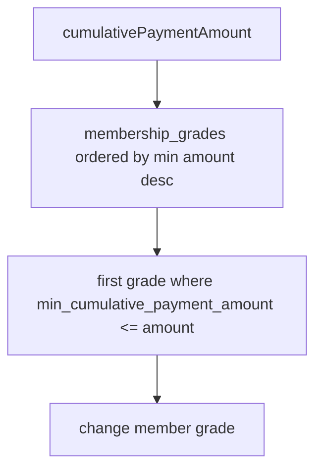

# Membership

멤버십은 회원별 누적 결제 금액에 따라 등급과 포인트 적립률을 결정합니다.

## 등급 정책

현재 Flyway seed 기준 등급은 다음과 같습니다.

| Grade | Minimum Cumulative Payment Amount | Point Reward Rate |
| --- | ---: | ---: |
| `NORMAL` | 0 | 1% |
| `VIP` | 50,000 | 5% |
| `VVIP` | 100,000 | 10% |

## 회원가입 시 멤버십 생성

1. `AuthService.signup`이 회원을 생성합니다.
2. `membership_grades`에서 `NORMAL` 등급을 조회합니다.
3. `MemberMembership.create(member, defaultGrade)`로 회원별 멤버십을 생성합니다.
4. 누적 결제 금액은 0으로 시작합니다.

## 결제 반영

- 결제 확정 후 `PaymentPostProcessService`가 `MembershipService.applyPayment`를 호출합니다.
- 멤버십 누적 금액에는 `payment.finalPaymentAmount`가 더해집니다.
- 포인트 사용 금액은 멤버십 누적 결제 금액에 더하지 않습니다.
- 누적 금액 변경 후 `resolveGrade`로 현재 등급을 다시 산정합니다.

## 환불 반영

- 환불 완료 후 `RefundPostProcessService`가 `MembershipService.applyRefund`를 호출합니다.
- 멤버십 누적 금액에서는 `refund.pgRefundAmount`가 차감됩니다.
- 차감 결과가 0 아래로 내려가지 않도록 엔티티에서 관리합니다.
- 차감 후 등급을 다시 산정합니다.

## 재계산

`POST /api/memberships/recalculate`은 현재 저장된 누적 금액을 결제/환불 이력 기준으로 다시 계산합니다.

계산식:

```text
max(0, confirmedPaymentAmount - completedRefundAmount)
```

기준 데이터:

- 확정 결제 합계: `PaymentRepository.sumConfirmedFinalPaymentAmountByMemberId`
- 완료 환불 합계: `RefundRepository.sumCompletedRefundAmountByMemberId`

응답에는 재계산 전/후 snapshot과 등급 변경 여부가 포함됩니다.

## 등급 산정 규칙



