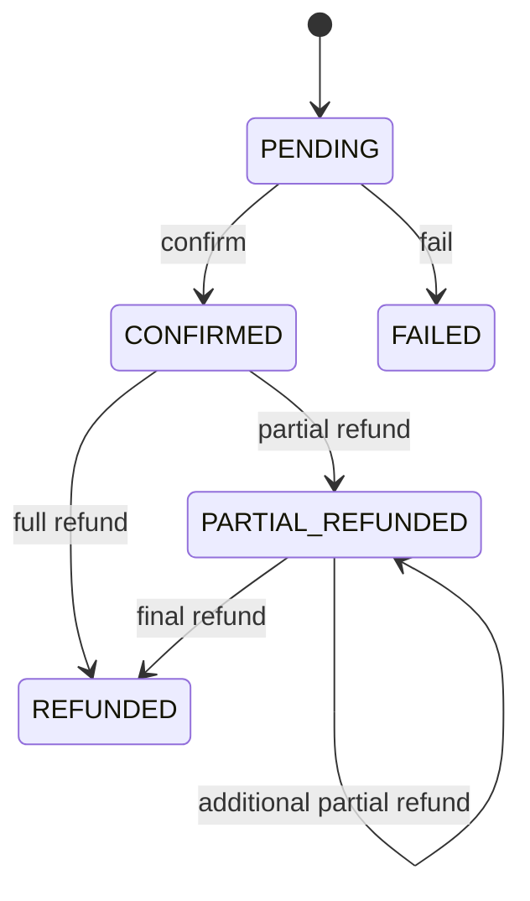
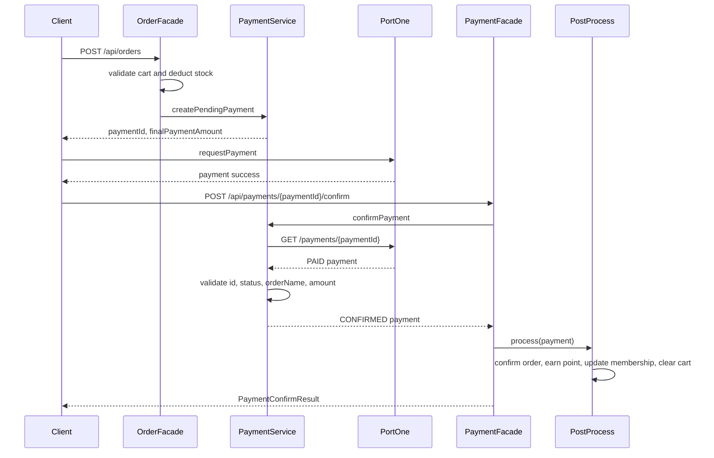
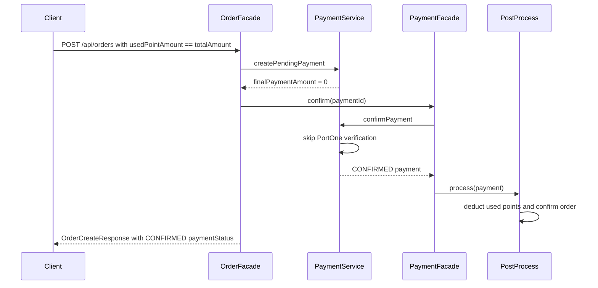
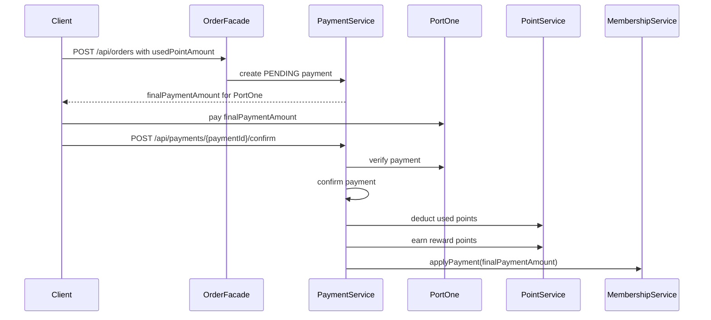

# Payment

결제 도메인은 주문 생성 시 `PENDING` 결제를 만들고, 결제 확정 API 또는 Webhook을 통해 내부 결제를 `CONFIRMED`로 전환합니다.

## 상태 전이

## 일반 결제

일반 결제는 `finalPaymentAmount > 0`이고 `usedPointAmount == 0`인 결제입니다.

### 비즈니스 흐름

1. 주문 생성 API가 장바구니 항목과 상품 재고를 검증합니다.
2. 상품 재고를 차감합니다.
3. 주문을 생성합니다.
4. `PaymentService.createPendingPayment`가 `PENDING` 결제를 생성합니다.
5. 클라이언트는 응답의 `paymentId`, `paymentOrderName`, `finalPaymentAmount`로 PortOne 결제창을 호출합니다.
6. 결제 성공 후 `POST /api/payments/{paymentId}/confirm`을 호출합니다.
7. 서버는 PortOne 결제 조회 결과를 검증합니다.
8. 결제를 `CONFIRMED`로 변경합니다.
9. 주문 확정, 포인트 적립, 멤버십 반영, 장바구니 정리를 수행합니다.

### Sequence Diagram

## 포인트 전액 결제

포인트 전액 결제는 `finalPaymentAmount == 0`인 결제입니다.

### 비즈니스 흐름

1. 주문 생성 시 사용 포인트가 주문 총액과 같으면 `finalPaymentAmount`가 0입니다.
2. `OrderFacade`가 `PaymentConfirmFacade.confirm`을 즉시 호출합니다.
3. `PaymentService`는 PortOne 조회 없이 내부 결제를 확정합니다.
4. 포인트 사용 차감, 포인트 적립, 멤버십 반영, 주문 확정, 장바구니 정리를 수행합니다.

### Sequence Diagram

## 복합 결제

복합 결제는 `usedPointAmount > 0`이고 `finalPaymentAmount > 0`인 결제입니다.

### 비즈니스 흐름

1. 주문 생성 시 포인트 사용 금액과 최종 PG 결제 금액을 함께 저장합니다.
2. PortOne에는 `finalPaymentAmount`만 결제 요청합니다.
3. 결제 확정 시 PortOne `amount.total`이 내부 `finalPaymentAmount`와 일치해야 합니다.
4. 결제 확정 후 사용 포인트를 차감합니다.
5. 멤버십 등급에 따른 적립 포인트를 지급합니다.
6. 멤버십 누적 금액에는 PG 결제 금액(`finalPaymentAmount`)을 반영합니다.

### Sequence Diagram

