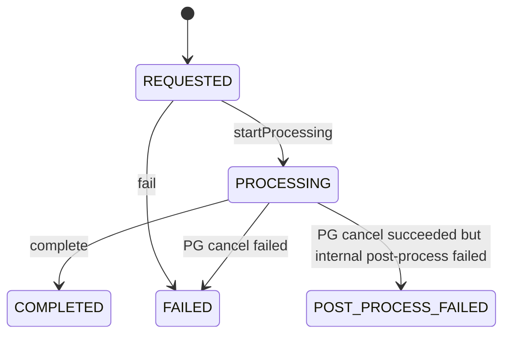
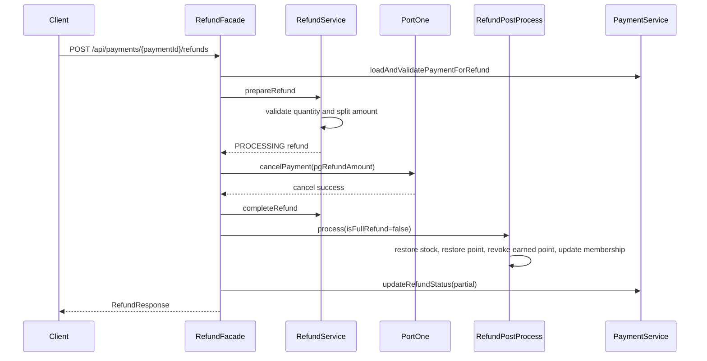
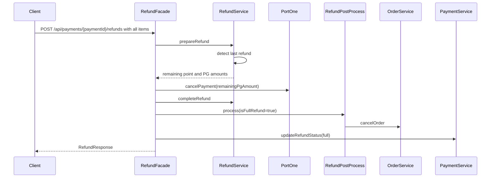

# Refund

환불은 결제 건의 주문 상품을 기준으로 요청합니다. 환불 금액은 기존 결제의 `usedPointAmount`와 `finalPaymentAmount` 비율, 그리고 마지막 환불 여부를 기준으로 포인트 환불 금액과 PG 환불 금액으로 분리됩니다.

## 상태 전이

## 부분 환불

### 비즈니스 흐름

1. `POST /api/payments/{paymentId}/refunds`를 호출합니다.
2. 결제 존재 여부, 소유자, 환불 가능한 결제 상태를 검증합니다.
3. 주문 상품과 요청 수량을 검증합니다.
4. 기존 환불 수량과 금액을 합산해 환불 가능 범위를 확인합니다.
5. 요청 상품 금액을 기준으로 포인트 환불 금액과 PG 환불 금액을 계산합니다.
6. 환불 상태를 `PROCESSING`으로 저장합니다.
7. PG 환불 금액이 0보다 크면 PortOne cancel API를 호출합니다.
8. 환불을 `COMPLETED`로 변경합니다.
9. 재고 복구, 포인트 복구, 적립 포인트 일부 회수, 멤버십 차감을 수행합니다.
10. 결제 상태를 `PARTIAL_REFUNDED`로 변경합니다.

### Sequence Diagram

## 전체 환불

### 비즈니스 흐름

1. 전체 주문 수량을 환불 요청합니다.
2. 마지막 환불이면 남은 포인트 금액과 남은 PG 금액을 모두 환불 대상으로 계산합니다.
3. PG 취소가 필요한 경우 PortOne cancel API를 호출합니다.
4. 환불을 `COMPLETED`로 변경합니다.
5. 모든 재고를 복구합니다.
6. 사용 포인트를 복구합니다.
7. 결제 때 적립된 포인트 중 아직 회수되지 않은 금액을 회수합니다.
8. 멤버십 누적 결제 금액에서 PG 환불 금액을 차감합니다.
9. 주문을 `CANCELLED`로 변경합니다.
10. 결제를 `REFUNDED`로 변경합니다.

### Sequence Diagram

## 실패 처리

- PortOne 환불 요청이 실패하면 환불 상태는 `FAILED`가 됩니다.
- PortOne 환불은 성공했지만 내부 후처리가 실패하면 환불 상태는 `POST_PROCESS_FAILED`가 됩니다.
- `POST_PROCESS_FAILED`는 PG 취소 금액을 이미 환불 완료 금액에 포함해야 하므로, 중복 환불 계산에서 완료 환불과 함께 반영됩니다.

