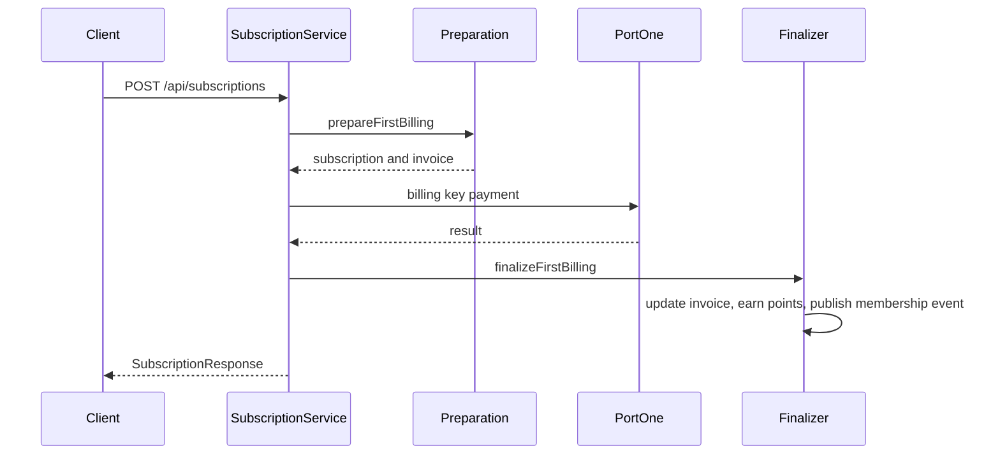
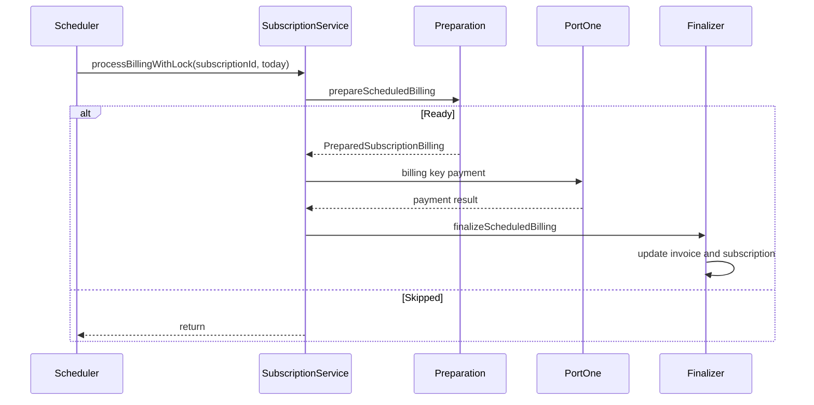

# Subscription

구독 도메인은 PortOne 빌링키를 등록하고, 구독 시작 시 최초 결제, 이후 스케줄러 기반 정기 결제를 수행합니다.

## 구독 신청

### 비즈니스 흐름

1. 클라이언트가 PortOne Browser SDK로 빌링키를 발급받습니다.
2. `POST /api/subscriptions/payment-methods`로 빌링키를 등록합니다.
3. `POST /api/subscriptions`로 요금제와 결제 수단을 지정합니다.
4. `SubscriptionBillingPreparationService.prepareFirstBilling`이 구독과 PENDING invoice를 생성합니다.
5. `SubscriptionPaymentOrchestrator`가 트랜잭션 밖에서 PortOne 빌링키 결제를 호출합니다.
6. `SubscriptionBillingFinalizer.finalizeFirstBilling`이 결제 결과를 반영합니다.
7. 성공 시 invoice를 `SUCCEEDED`로 변경하고 포인트를 적립합니다.
8. 실패 시 구독을 취소하고 invoice를 `FAILED`로 변경합니다.

## 구독 해지

- `POST /api/subscriptions/cancel/{subscriptionId}`를 호출합니다.
- 구독 소유자가 현재 인증 회원인지 확인합니다.
- 구독 상태를 `CANCELLED`로 변경합니다.
- 실제 PortOne 빌링키 삭제 API 호출은 현재 Controller 흐름에는 포함되어 있지 않습니다.

## 정기 결제 흐름

### 스케줄러

- `SubscriptionScheduler.runSubscriptionBilling`
- 매일 00:00 KST 실행
- `ACTIVE` 상태이며 `nextBillingDate <= today`인 구독을 조회합니다.
- page size는 `subscription.billing.scheduler.page-size` 설정을 사용합니다.
- 각 구독은 thread pool executor로 병렬 처리합니다.

### 결제 준비

- 구독 row를 pessimistic lock으로 조회합니다.
- 같은 `subscription_id`, `billing_period`의 invoice가 있으면 중복 생성을 건너뜁니다.
- `sub-sched-{subscriptionId}-{today}` 형태의 PortOne payment ID를 사용합니다.

### 결제 결과 반영

- 성공 시 invoice를 `SUCCEEDED`로 변경합니다.
- 성공 시 포인트를 적립하고 멤버십 이벤트를 발행합니다.
- 남아 있는 실패 invoice가 없으면 미납 상태를 해제합니다.
- 다음 결제일을 갱신합니다.
- 실패 시 invoice를 `FAILED`로 변경하고 구독을 미납 상태로 표시합니다.

## 미납 재시도

- `SubscriptionUnpaidRetryScheduler.retryUnpaidBilling`
- 매일 14:00 실행
- `ACTIVE`이면서 `unpaid=true`인 구독을 조회합니다.
- 실패 invoice를 다시 PortOne 빌링키 결제로 청구합니다.
- 성공하면 invoice를 `SUCCEEDED`로 변경하고 남은 실패 invoice가 없으면 미납 상태를 해제합니다.

