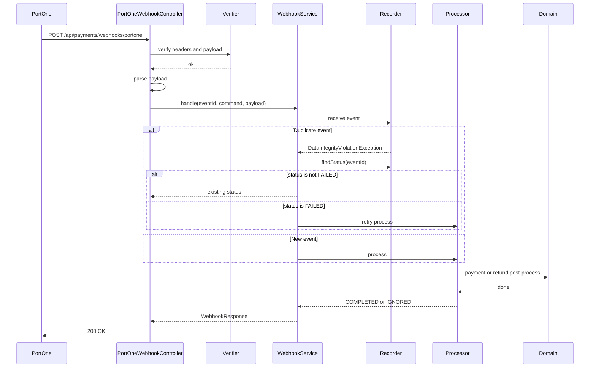

# Webhook

PortOne Webhook은 `/api/payments/webhooks/portone`으로 수신합니다.

## 수신

Controller는 다음 헤더와 body를 받습니다.

| Header | Description |
| --- | --- |
| `webhook-id` | PortOne Webhook event ID |
| `webhook-timestamp` | Webhook timestamp |
| `webhook-signature` | Webhook signature |

Body는 PortOne Webhook payload 원문입니다.

## 검증

`PortOneWebhookSignatureVerifier`가 다음 정보를 사용해 서명을 검증합니다.

- event ID
- timestamp
- signature
- raw payload
- `portone.webhook.secret`

검증 실패 시 `WEBHOOK_001` 오류를 반환합니다.

## 저장

`WebhookService.handle`은 수신한 Webhook을 먼저 저장합니다.

저장 데이터:

- `event_id`
- `payment_id`
- `event_type`
- `payload`
- `status`
- `received_at`

`event_id`는 primary key이므로 같은 event가 다시 들어오면 중복 insert가 실패합니다.

중복 event 처리:

- 기존 상태가 `COMPLETED` 또는 `IGNORED`이면 기존 상태를 반환합니다.
- 기존 상태가 `FAILED`이면 다시 처리를 시도합니다.

## 후처리

지원 event:

- `PAYMENT_PAID`
- `PAYMENT_CANCELLED`
- `PAYMENT_PARTIAL_CANCELLED`

`PAYMENT_PAID`:

1. 결제를 조회합니다.
2. 이미 확정된 결제면 event를 `IGNORED`로 처리합니다.
3. 미확정 결제면 PortOne 결제 조회로 검증합니다.
4. 결제를 확정합니다.
5. 주문, 포인트, 멤버십, 장바구니 후처리를 수행합니다.
6. event를 `COMPLETED`로 처리합니다.

`PAYMENT_CANCELLED`, `PAYMENT_PARTIAL_CANCELLED`:

1. 결제를 조회합니다.
2. 처리 중인 환불(`PROCESSING`)을 찾습니다.
3. 없으면 event를 `IGNORED`로 처리합니다.
4. 환불을 `COMPLETED`로 변경합니다.
5. 재고, 포인트, 멤버십, 주문/결제 상태 후처리를 수행합니다.
6. event를 `COMPLETED`로 처리합니다.

## Sequence Diagram

